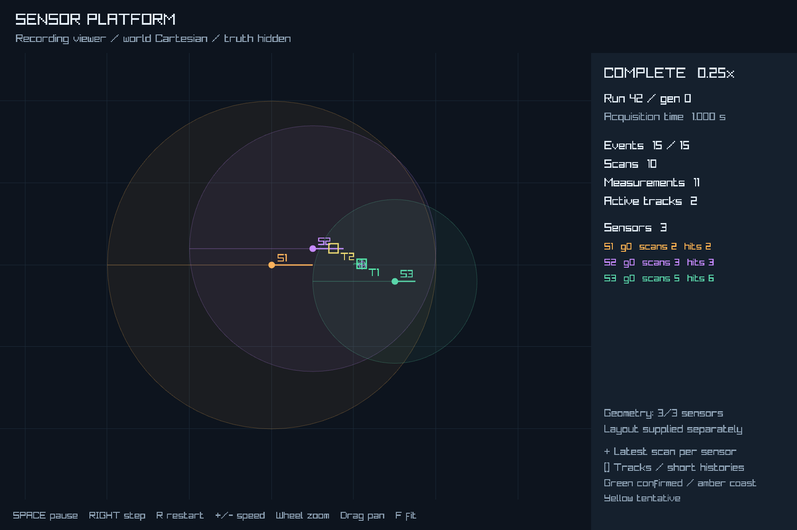
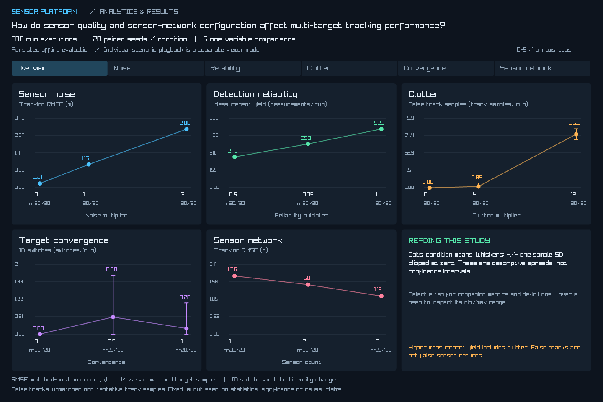
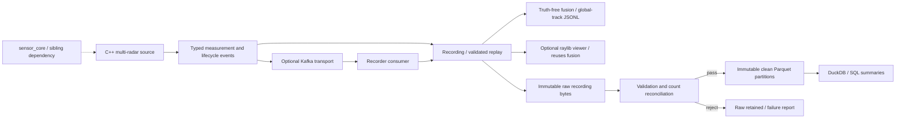

# sensor-platform

A C++20 and Python platform for turning multi-radar observations into replayable events, global tracks and validated analytical datasets. It makes sensor timing, delivery failures and processing results inspectable without coupling consumers to the simulation loop.

One deterministic source feeds local recordings or Kafka. The same events drive truth-free fusion, a graphical recording viewer and a raw-to-clean data pipeline. Controlled load and failure experiments measure latency, backlog and recovery.



*Actual run-42 recording: 15 events, 10 scans, 11 measurements and 2 active tracks. Sensor geometry is supplied separately; ground truth is hidden. [Viewer controls](docs/viewer.md) · [Screenshot provenance](docs/assets/README.md)*

## Quick start: one-command demo

Prerequisites: CMake 3.20+, a C++20 compiler, Python 3.11+, and the sibling `sensor-sandbox` checkout containing the `sensor_core` CMake target:

```text
workspace/
  sensor-platform/   # this repository: runtime, transport, fusion, data and viewer
  sensor-sandbox/    # source dependency providing sensor_core
```

From this repository, create the Python environment and install the analytics dependency. Windows commands are shown; on Linux/macOS replace `.venv/Scripts/python.exe` with `.venv/bin/python`:

```sh
python -m venv .venv
.venv/Scripts/python.exe -m pip install -r analytics/requirements.txt
python scripts/dev.py --build-dir build/demo build --target sensor_platform
python scripts/dev.py --build-dir build/demo demo
```

For any configured build directory, the entry point is:

```sh
python scripts/dev.py --build-dir <build> demo
```

The demo procedurally generates four targets and three radars, verifies replay equivalence, runs fusion, ingests through the quality gate, executes existing SQL summaries and prepares a matching viewer layout. Target and sensor-layout seeds are independent; `demo --help` exposes seeds, duration and counts. Results go to **`demo/results/`**: start with `summary.json`, the CSV summaries and `viewer.md`. Repeating the same configuration produces the same recording and returns ingestion status `unchanged`. [Generation rules and configuration API](docs/procedural-scenarios.md).

Kafka and raylib are optional; neither is required for the demo. To open the recording graphically, [build the viewer](docs/viewer.md) and use the command in `demo/results/viewer.md`. Or run `python scripts/dev.py viewer` and use its compact procedural controls and **Generate / Run** button. Dependencies and builds are explicit, never implicit side effects of running the demo. [Full artifact list and repeatability](docs/demo.md) · [Developer commands](docs/development.md)

## Multi-seed analytics study

**How do sensor quality and sensor-network configuration affect multi-target tracking performance?**

The curated study uses **300 run executions**: five one-variable comparisons, three conditions each, and 20 paired target seeds per condition. Runs last 20 simulated seconds. Individual results, canonical SQL aggregates, provenance and a descriptive report are retained. Shared baselines represent 240 distinct configurations; this is not a full Cartesian parameter grid.

```powershell
python scripts/dev.py build --target sensor_platform
python scripts/dev.py build --target sensor_platform_viewer
python scripts/dev.py study generate --output data/studies/curated
python scripts/dev.py results
# Reanalyze saved sweeps without generating runs:
python scripts/dev.py study analyze data/studies/curated --output data/studies/curated/reanalysis
```

The separate **Analytics & Results** mode in the existing raylib application loads only persisted aggregates. Its overview and five dimension tabs show means, sample-SD whiskers, valid run counts and metric definitions. `python scripts/dev.py viewer` still opens individual scenario playback. Production sensor events remain truth-free; tracking metrics use separate offline truth-based evaluation.

In this experiment, noise 0 to 3 was associated with mean tracking RMSE of **0.2130 to 2.8774 m**. Reliability 0.5 to 1 produced **274.7 to 522.2 measurements/run**. Clutter 0 to 12 increased false-track samples from **0 to 35.3/run**, while matched-track RMSE changed only from **1.1502 to 1.1560 m**: RMSE alone hides that degradation. These are descriptive means from one fixed-layout study, not significance or causal claims.

[Study design, results and limitations](docs/curated-study.md) · [Canonical metric definitions](docs/canonical-analyses.md)



*Verified application capture. The full study ran once in 50 minutes 5.6 seconds, including ingestion and analysis. Convergence showed non-monotonic mean ID switches (0 / 0.6 / 0.2); increasing sensor count was associated with RMSE of 1.7605 / 1.4971 / 1.1502 m. [Screenshot provenance](docs/assets/README.md)*

## Architecture



`sensor-platform` owns orchestration, recording, transport, fusion and data tooling. It consumes `sensor_core` through CMake `add_subdirectory` from the sibling checkout, with sandbox app/tests disabled. It does not copy the sandbox application. The headless targets have no raylib dependency; viewer playback consumes recorded events. Its Generate / Run action prepares a complete recording through a headless adapter; rendering never advances simulation. [Architecture and implementation history](docs/architecture.md)

## Engineering capabilities

- **Deterministic multi-radar source:** one authoritative world, independent seeded scanners and explicit acquisition times. Empty scans differ from not-due polls. [Timing and identity contract](docs/event-recording.md)
- **Typed events and replay:** run/sensor generations, contiguous global sequences, complete-run validation and exact measurement-field round trips. Optional **Kafka transport** adds independent consumers, acknowledged publishing and tested restart/reconstruction behavior. [Kafka semantics](docs/kafka.md)
- **Truth-free multi-sensor fusion:** distance-gated association, velocity prediction, confirmation, coasting and expiry. Evaluation truth is separate from runtime inputs and outputs. [Fusion and evaluation](docs/fusion.md)
- **Incremental, idempotent ingestion:** immutable raw bytes, immutable per-run clean partitions, conflict rejection and recovery after interrupted conversion. The **quality gate** checks lifecycle, sequences, acquisition times, identities and counts, then reconciles persisted rows before publication. Rejected sources stay in raw storage with diagnostics. **Parquet/DuckDB** preserves separate event, scan and measurement tables. [Data pipeline and quality reports](docs/analytics.md)
- **Observable processing:** load, pause, delayed-consumer and sensor-outage experiments retain evidence and measure latency/backlog/recovery. The **event-driven viewer** shows detections, fused tracks, short histories and counters, with optional sensor geometry. [Experiments](docs/experiments.md) · [Viewer](docs/viewer.md)

## Representative measured results

These are recorded development results, not capacity guarantees. Transport runs were measured on **2026-09-11, Windows 11, MSVC Debug, same-host Kafka 4.0.0/Java 21**, without warm-up or tuning. Latency includes startup, queueing, processing and output flushes. Fusion evaluation uses seed 42 and default settings; RMSE is in world units.

| Workload | Observed result | Evidence |
| --- | --- | --- |
| Procedural demo, 4 targets / 3 radars / 20 seconds | 148 events, 143 scans, 522 measurements; 4 final tracks; quality passed | [Demo](docs/demo.md) |
| Fusion, three sensors at 2/4/8 Hz | Position RMSE 0.0080; 1 missed sample of 65; 0 ID switches | [Evaluation](docs/fusion.md) |
| Fusion, sparse close crossing | Position RMSE 0.0372 but 2 ID switches | [Known association limit](docs/fusion.md) |
| Local load, 16 sensors at 40 Hz | 1,314 events; 653.67 consumed/s; p95 1.30 ms; peak backlog 14 | [Load comparison](docs/experiments.md) |
| Same load over Kafka | 63.11 consumed/s; p95 18,765.65 ms; peak backlog 1,243 | [Bottleneck evidence](docs/experiments.md) |
| One-second consumer pause | Local/Kafka catch-up: 0.004/0.848 s; peak backlog: 29/42 | [Recovery measurements](docs/experiments.md) |

All ten recorded transport/scenario runs finished with zero missing, duplicate, conflicting or out-of-order events, matching payloads and zero final backlog. The Kafka load result exposes the current consumer bottleneck; synchronous per-event commits and instrumentation are possible contributors, not isolated causes.

## Project structure

| Path | Responsibility |
| --- | --- |
| [`src/`](src/) | C++ runner, event recording, Kafka adapter and global fusion |
| [`src/viewer/`](src/viewer/) | Optional graphical consumer and headless viewer state |
| [`analytics/`](analytics/) | Ingestion, quality reports, Parquet materialization and SQL |
| [`experiments/`](experiments/) | Controlled transport/load/failure scenarios and reports |
| [`evaluation/`](evaluation/) | Separate truth-based fusion fixtures and metrics |
| [`scripts/`](scripts/) · [`tools/`](tools/) | Developer/demo orchestration and integration validation |
| [`tests/`](tests/) · [`docs/`](docs/) | Focused C++ tests and detailed technical documentation |

## Design decisions and trade-offs

- **Centralized world, independent consumers.** Distribution begins at observations; rendering and wall-clock backpressure do not change simulation timestamps. Late polls observe current state once rather than invent missed historical scans.
- **Explicit ordering over broad distribution.** Kafka uses one retained partition per run. Consumers commit after output; crash windows can repeat visible events. This is not end-to-end exactly-once delivery.
- **Immutable publication over updates.** Clean runs publish by staging-directory rename. Identical typed duplicates normalize away; conflicting run identities fail. Raw and clean publication are separate operations, with retry recovery.
- **Small, inspectable baseline.** Local C++ and Python tools reuse decoding, validation, fusion and SQL. The sibling dependency is its current working tree, not a pinned package; set `SENSOR_SANDBOX_SOURCE_DIR` to override its location.

## Limitations and next steps

Recordings and analytics are batch-loaded in memory; ingestion assumes one writer and local storage. Quality checks establish structural consistency, not physical plausibility or sensor calibration. The viewer reads complete recordings and uses a display-only layout because v1 events lack sensor pose/FOV metadata.

Nearest-neighbour fusion can swap crossing identities and confirm persistent false returns. Determinism is scoped to the same inputs/build/numeric environment. Transport measurements are single-host development observations, not a distributed benchmark. There is no cloud deployment or continuous Kafka-to-Parquet service.

Useful next work: controlled Release-build profiling and commit-batching/restart tests; association comparisons across seeds and sampling gaps; larger datasets, retention and durable checkpoints. See the [roadmap and shipped milestones](docs/roadmap.md).
